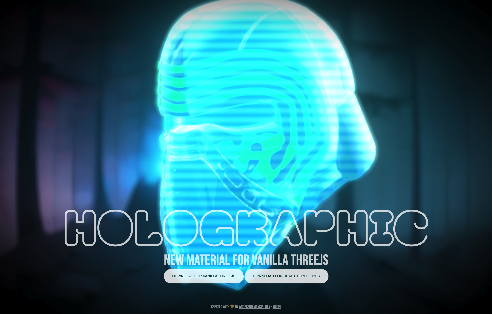

# Holographic Material for Vanilla Three.js

A simple to use holographic material for threejs

<p align="center">
    <a href="https://threejs-vanilla-holographic-material.vercel.app/" target="_blank"></a>
</p>

Live link: <a href="https://threejs-vanilla-holographic-material.vercel.app/" target="_blank">https://threejs-vanilla-holographic-material.vercel.app/</a>

CodeSandBox simplest example: <a href="https://codesandbox.io/p/sandbox/three-js-vanilla-holographic-material-8clmrd" target="_blank">https://codesandbox.io/p/sandbox/three-js-vanilla-holographic-material-8clmrd</a>

# Introduction

Dive into a world of mesmerizing holographic wonders with the HolographicMaterial for vanilla three.js. This enchanting three.js material brings your virtual reality experiences to life, infusing them with a burst of vibrant colors, dynamic scanlines, and a touch of futuristic brilliance.

While this material operates independently of any post-processing, it achieves an enhanced visual appeal when coupled with bloom effects. The utilization of bloom proves particularly effective in rendering a captivating glow effect, especially in areas where overexposure is prevalent.

# HOW TO USE?

### 1: Download the Material

Create a new file with the contents of [this gist](https://gist.github.com/ektogamat/b149d9154f86c128c9fea52c974dda1a) on your project and save it as 'HolographicMaterialVanilla.js'

### 2: Import the material

```
import HolographicMaterial from './HolographicMaterialVanilla.js'
```

### 3: Add this as a material for your mesh

```
// ...
const geometry = new THREE.BoxGeometry();
const holographicMaterial = new HolographicMaterial();
const cube = new THREE.Mesh(geometry, holographicMaterial);
scene.add(cube);
// ...
...

```

### 4: Update the material inside render loop

```
// ...
const tick = () => {
  holographicMaterial.update() // Update the holographic material time uniform
  window.requestAnimationFrame(tick)
}

tick()
// ...
```

That's all that you need to use this material. Of course you can customize it as shown bellow.

# Properties

| Name               | Type                                              | Default   | Description                                                                                                                   |
| ------------------ | ------------------------------------------------- | --------- | ----------------------------------------------------------------------------------------------------------------------------- |
| fresnelAmount      | Number                                            | 0.45      | Controls the value of the Fresnel effect. Ranges from 0.0 to 1.0.                                                             |
| fresnelOpacity     | Number                                            | 1.0       | Controls the opacity of the Fresnel effect. Ranges from 0.0 to 1.0.                                                           |
| scanlineSize       | Number                                            | 8.0       | Controls the size of the scanlines. Ranges from 1 to 15.                                                                      |
| hologramBrightness | Number                                            | 1.2       | Controls the brightness of the hologram. Ranges from 0.0 to 2.0.                                                              |
| signalSpeed        | Number                                            | 0.45      | Controls the speed of the signal effect. Ranges from 0.0 to 2.0.                                                              |
| hologramColor      | String                                            | "#00d5ff" | Specifies the color of the hologram. Use hexadecimal format.                                                                  |
| enableBlinking     | Boolean                                           | true      | Enables or disables the blinking effect. Defaults to true.                                                                    |
| hologramOpacity    | Number                                            | 1.0       | Specifies the opacity of the hologram. Defaults to 1.0.                                                                       |
| enableBlinking     | Boolean                                           | true      | Enables or disables the blinking effect. Defaults to true.                                                                    |
| blinkFresnelOnly   | Boolean                                           | true      | Enables or disables the blinking effect for the Fresnel only. Defaults to true.                                               |
| enableAdditive     | Boolean                                           | true      | Enables or disables the Additive Blend Mode. Defaults to true.                                                                |
| side               | THREE.FrontSide, THREE.BackSide, THREE.DoubleSide | FrontSide | Specifies side for the material, as String. Options are "FrontSide", "BackSide", "DoubleSide". Defaults to "THREE.FrontSide". |

Here is an example of how you can pass these props. If you pass any of those props, the default values will be overwritten.

```
const holographicMaterial = new HolographicMaterial({
    fresnelAmount: 0.2,
    fresnelOpacity: 0.15,
    hologramBrightness: 0.7,
    scanlineSize: 6,
    signalSpeed: 2.3,
    hologramColor: "#ff0000",
    hologramOpacity: 1.0,
    blinkFresnelOnly: true,
    enableBlinking: true,
    enableAdditive: true,
    side: THREE.FrontSide,
});
```

You can also use dat.GUI to create a panel, like in the demo, so you can tweak the parameters live.

```
// Add dat.GUI controls
const gui = new dat.GUI();
gui.add(holographicMaterial, 'fresnelAmount', 0.0, 1.0).name('Fresnel Amount');
gui.add(holographicMaterial, 'fresnelOpacity', 0.0, 1.0).name('Fresnel Opacity');
gui.add(holographicMaterial, 'scanlineSize', 1.0, 15.0).name('Scanline Size');
gui.add(holographicMaterial, 'hologramBrightness', 0.0, 2.0).name('Hologram Brightness');
gui.add(holographicMaterial, 'signalSpeed', 0.0, 2.0).name('Signal Speed');
gui.addColor(holographicMaterial, 'hologramColor').name('Hologram Color');
gui.add(holographicMaterial, 'enableBlinking').name('Enable Blinking');
gui.add(holographicMaterial, 'blinkFresnelOnly').name('Blink Fresnel Only');
gui.add(holographicMaterial, 'hologramOpacity', 0.0, 1.0).name('Hologram Opacity');
gui.add(holographicMaterial, 'enableAdditive').name('Enable Additive');

```

### Show, don't tell

Here you can [see a video with](https://www.youtube.com/watch?v=njJc-O_imb4) it in action and some options

### License

This component is an open-source creation released under the (MIT) license. While you're free to integrate and innovate with it, I would genuinely appreciate knowing when this HolographicMaterial component sparks creativity in your projects!

### Resources

Resources: [Threejs](https://threejs.org/), [WebGL](https://github.com/KhronosGroup/WebGL), [Poimanders post processing](https://github.com/pmndrs/postprocessing)

# Can you leave a star please?

Would be really appreciated if you are willing to give me a star here on GitHub 🎉 or buy me a coffee ☕ https://www.buymeacoffee.com/andersonmancini. The money will be used to produce more content about threejs or to buy new courses.
